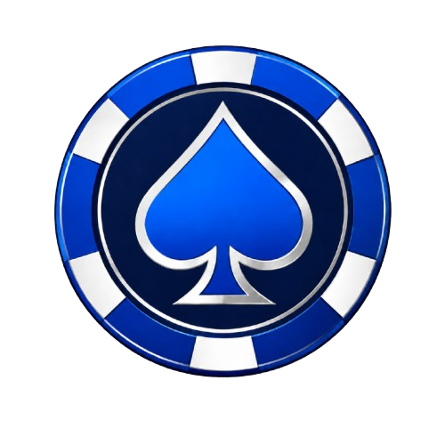
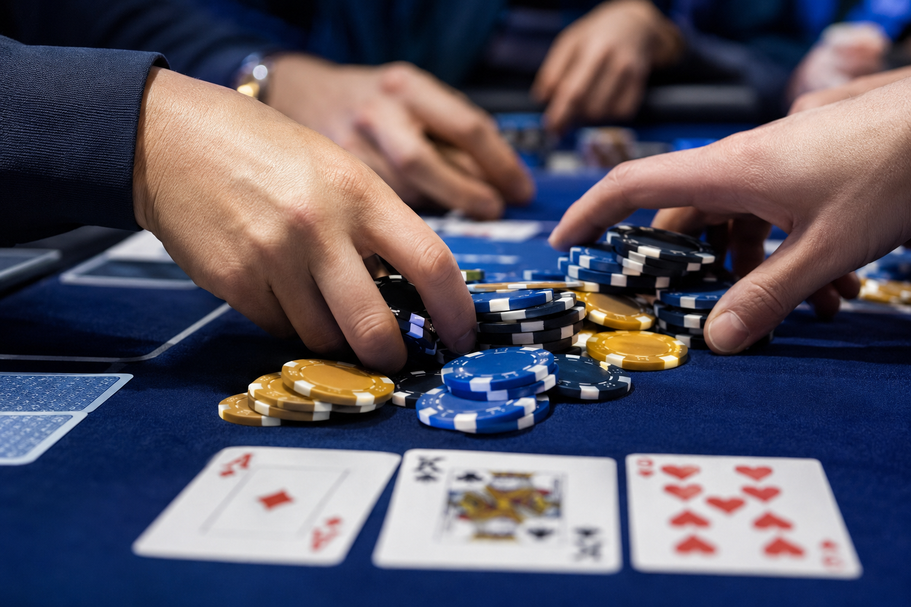
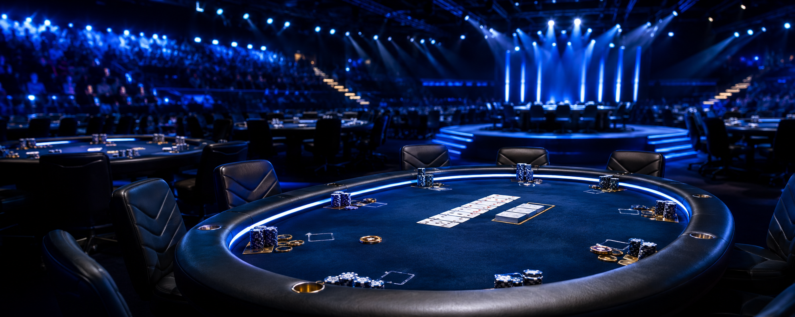

<p align="center">
  
</p>

<h1 align="center">♠️ BluePoker</h1>
<h3 align="center">Premium Poker Platform — Built with Elegance, Played with Passion</h3>

<p align="center">
  
  
  
  
  
</p>

<p align="center">
  
  
  
  
</p>

---

## 🎯 Overview

**BluePoker** is a modern, premium poker gaming platform built on the .NET 8 WPF framework. Designed with a stunning dark-theme interface featuring electric blue and gold accents, BluePoker delivers a first-class user experience with smooth animations, an immersive carousel, and a sleek authentication system.

Whether you're a player looking for a premium poker experience or a developer seeking a well-architected WPF reference project, BluePoker has something for you.

---

## 📸 Screenshots

<p align="center">
  <strong>🎨 Premium Dark-Theme Login Screen</strong><br/>
  <em>Electric blue glow & animated carousel — poker never looked this good.</em>
</p>

<p align="center">
  
</p>

<p align="center">
  <strong>✨ Sleek Login Panel with Logo</strong><br/>
  <em>Clean authentication card with the iconic BluePoker branding.</em>
</p>

<p align="center">
  
</p>

<p align="center">
  <strong>🔥 Animated Carousel Experience</strong><br/>
  <em>Seamless image transitions with blur effects — setting the mood.</em>
</p>

<p align="center">
  
</p>

<p align="center">
  
</p>

---

## ✨ Features

| Category | Feature | Description |
|----------|---------|-------------|
| 🎨 **UI/UX** | Dark Premium Theme | Deep navy background (#0A0E27) with radial gradient overlays |
| ⚡ **Animation** | Multi-Slide Carousel | Smooth 3-slide carousel with blur transitions & dot indicators |
| 🔘 **Interactions** | Animated Buttons | Hover glow effects, scale animations with `BackEase`, and shine sweeps |
| 🔐 **Auth** | Login System | Email & password authentication with real-time error display |
| 🖼️ **Branding** | Custom Logo & Icon | Vector-quality logo + `.ico` for Windows taskbar / title bar |
| 🪟 **Window** | Custom Title Bar | Borderless window with custom minimize/close buttons & drag support |
| 🧩 **Architecture** | Clean WPF MVVM-ready | Separated XAML resources, styles, and code-behind logic |

---

## 🛠️ Tech Stack

```
.NET 8.0          ▰▰▰▰▰▰▰▰▰▰  Runtime & SDK
WPF (Windows)     ▰▰▰▰▰▰▰▰▰▰  UI Framework
XAML              ▰▰▰▰▰▰▰▰▰▰  Markup & Styling
C# 11             ▰▰▰▰▰▰▰▰▰▰  Code-Behind Logic
```

| Technology | Role |
|------------|------|
| **.NET 8** | Cross-platform runtime, high performance |
| **WPF** | Hardware-accelerated desktop UI |
| **XAML** | Declarative styling, animations, and templates |
| **C#** | Event handling, carousel logic, auth |
| **Windows only** | Targets Windows 10 / 11 |

---

## 🚀 Getting Started

### Prerequisites

- [.NET 8 SDK](https://dotnet.microsoft.com/en-us/download/dotnet/8.0)
- Windows 10 or Windows 11
- Visual Studio 2022+ (or VS Code with C# extension)

### Installation

```bash
# 1. Clone the repository
git clone https://github.com/Tobi0006/BluePoker.git
cd BluePoker

# 2. Restore dependencies
dotnet restore

# 3. Build the project
dotnet build -c Release

# 4. Run BluePoker
dotnet run
```

### Publish (Standalone Executable)

```bash
dotnet publish -c Release -r win-x64 --self-contained true -p:PublishSingleFile=true
```

The `.exe` will be available in `publish/`.

---

## 📁 Project Structure

```
BluePoker/
├── App.xaml                  # Application-level resources & startup
├── App.xaml.cs               # Application entry point
├── MainWindow.xaml           # Main window UI (carousel, login, styles)
├── MainWindow.xaml.cs        # Main window logic & event handlers
├── BluePokerWpf.csproj       # .NET 8 WPF project file
├── logo.ico                  # Windows icon
├── logo.png                  # Brand logo (192x174)
├── landing1.png              # Carousel slide 1
├── landing3.png              # Carousel slide 3
├── landing4.png              # Carousel slide 2
├── README.md                 # You are here!
└── publish/                  # Published output files
```

---

## 🎮 Usage

1. **Launch** BluePoker — the borderless window appears centered on your screen.
2. **Browse** the carousel on the left — 3 slides auto-rotate with smooth blur transitions.
3. **Login** on the right panel — enter your credentials (demo mode for now).
4. **Enjoy** the premium poker aesthetic!

> 💡 *Tip: Hover over the Login button to see the animated glow & shine sweep effect!*

---

## 🤝 Contributing

We welcome contributions from the community! Here’s how you can help:

1. **Fork** the repository
2. **Create** a feature branch: `git checkout -b feature/amazing-feature`
3. **Commit** your changes: `git commit -m 'Add amazing feature'`
4. **Push** to the branch: `git push origin feature/amazing-feature`
5. **Open** a Pull Request

### Contribution Ideas

- [ ] Add Texas Hold'em game logic
- [ ] Implement multiplayer via SignalR
- [ ] Add card deck renderer with custom styles
- [ ] Leaderboard & player stats
- [ ] Dark/Light theme toggle
- [ ] MVVM refactor with data binding

---

## 📜 License

Distributed under the **MIT License**. See `LICENSE` for more information.

---

## 👤 Author

<p align="center">
  <strong>Tobi0006</strong><br/>
  <a href="https://github.com/Tobi0006">
    
  </a>
</p>

---

<p align="center">
  <sub>Made with ♠️ and a passion for premium poker.</sub><br/>
  <sub>© 2025 BluePoker. All rights reserved.</sub>
</p>